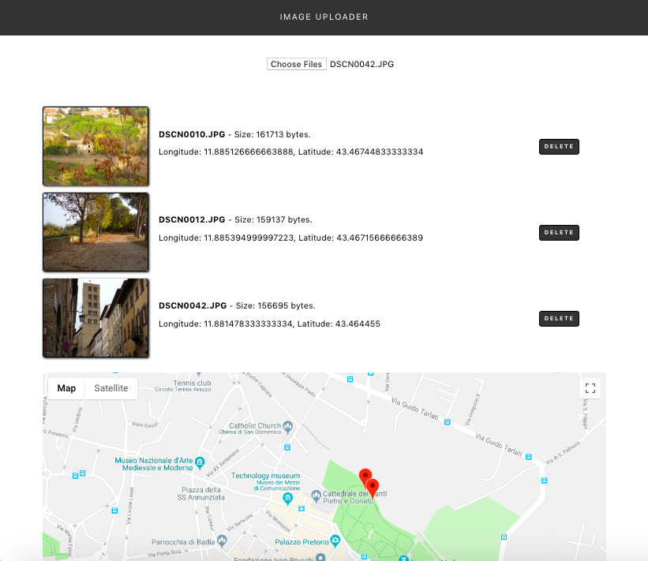

# Image Loader
This a responsive single-page app bootstrapped with Create React App.

### App's Functionality
The App allows to upload images from the user's device via File API. App's functionality:
1. Uploading images.  
2. Based on the images uploaded the following information is displayed:
- image's thumbnail, name, extension, size, latitutude and longitude coordinates (if available). Location data is extracted via Exif.js library. 
3. There is also possibility to delete an image from the list.
3. Rendering Google Maps API. Markers are displayed based on the location data extracted from the images list. Removing an image from the list updates markers displayed on the Google Map.    
5. All data APIs used in the project is handled asynchronously as well as errors are handled properly.  

### To get started:
* clone or download the project
* run `npm install` in order to install all the dependencies
* run `npm start` in order to start the development server

### Code Dependencies
The project was built with the [google-maps-react] using data via the [Exif.js] and [Google Maps API]. Icons are taken from the [FontAwesome] via react-icons library.

### Warning
The App has been tested in Chrome MAC OS only.

